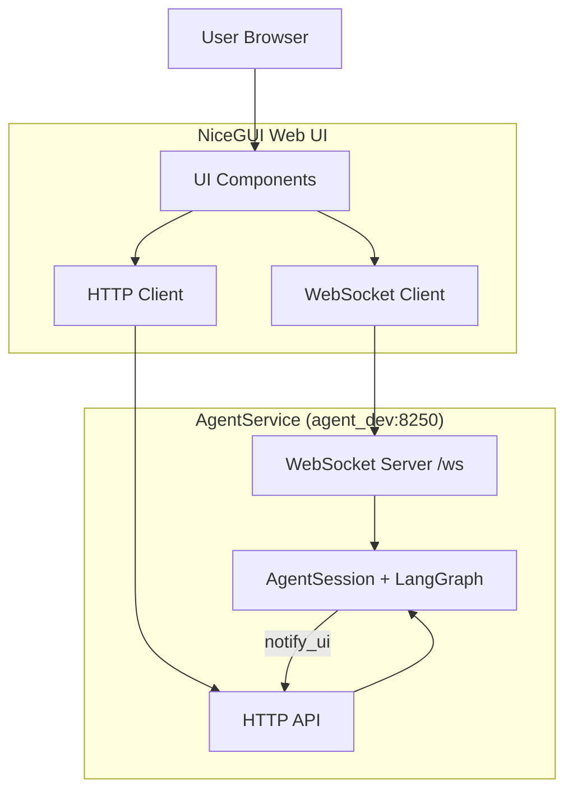

# Web UI Service (NiceGUI)

Веб-интерфейс для чата с агентом ЛЛМ на базе NiceGUI.

## 📋 Оглавление

- [Архитектура](#архитектура)
- [Запуск](#запуск)
- [Использование](#использование)
- [Тестирование](#тестирование)
- [API Endpoints](#api-endpoints)
- [Механизмы](#механизмы)
- [Документация](#документация)

---

## 🏗️ Архитектура

### Компоненты



**Поток данных:**
1. Пользователь вводит session_id → NiceGUI сохраняет
2. Нажимает "Подключиться" → WebSocket подключается к `/ws`
3. Отправляет сообщение → HTTP POST `/api/agent/run`
4. AgentService создает AgentSession → LangGraph flow
5. Каждый узел вызывает `notify_ui()` → POST `/api/agent/progress`
6. Web UI получает события → Отображает progress

---

## 🚀 Запуск

### Docker Compose (Dev)

```bash
docker-compose -f web_ui_service/docker-compose-dev.yml up -d
docker logs -f web_ui_service-web_ui_dev-1
```

### Ручной запуск

```bash
cd web_ui_service
uv run python web_ui.py --settings app_settings-dev.json
```

### Проверка

Откройте: `http://localhost:8350`

---

## 🎯 Использование

### Базовый сценарий

1. Откройте UI → `http://localhost:8350`
2. Введите session_id → например: `test_quiz_1`
3. Нажмите "Установить" → загружается история
4. Нажмите "Подключиться" → WebSocket активен
5. Отправьте сообщение → через API или UI

### Примеры session_id

- `test_quiz_1` — Тестовый квиз
- `dl_formulas_1` — Deep Learning формулы
- `rag_demo_1` — RAG демо
- `user_123` — Персональная сессия

---

## 🧪 Тестирование

### 1. Unit Test: Web UI Simulation (2.1)

**Цель:** Детерминированная симуляция без реального агента.

**Запуск:**
```bash
docker exec web_ui_service-web_ui_dev-1 uv run pytest tests/test_web_ui_simulation.py -v
```

**Результат:** 7/7 тестов проходят

**Что проверяется:**
- Формирование сообщений (User, Agent, Progress)
- Форматирование формул MathJax
- Стили сообщений
- Изоляция сессий
- Последовательность progress events
- WebSocket и HTTP mocks

**Формулы в тесте:**
- MSE: $$MSE = \frac{1}{n}\sum(y_i - \hat{y}_i)^2$$
- Линейная регрессия: $y = wx + b$
- Градиент: $\nabla L = \frac{2}{n}X^T(Xw - y)$

### 2. Тестирование через API + Просмотр в Web UI

**Сценарий:** Запускаем тест через API, наблюдаем в браузере.

**Шаг 1:** Подготовка UI
```bash
# Откройте http://localhost:8350
# Введите session_id: demo_quiz_1
# Нажмите "Установить" и "Подключиться"
```

**Шаг 2:** Запуск теста
```bash
docker exec web_ui_service-web_ui_dev-1 uv run python tests/test_task_g_demo.py
```

**Шаг 3:** Наблюдение в браузере
```
User: Сгенерируй квиз по Python
⏳ Progress: intent_determined
⏳ Progress: start_retrieval
⏳ Progress: retrieval_done
⏳ Progress: start_generate_exam
⏳ Progress: generate_done
📝 Agent: [сгенерированный квиз]
```

**Шаг 4:** Проверка истории
```bash
# Обновите страницу → "Загрузить историю"
```

### 3. Демо скрипт

**Файл:** `tests/test_task_g_demo.py`

Скрипт отправляет POST запрос к `/api/agent/run` и проверяет историю сообщений.

---

## 🔌 API Endpoints

### Web UI → AgentService

**POST /api/agent/run**
```http
POST http://localhost:8250/api/agent/run
Content-Type: application/json

{"question": "...", "session_id": "demo_quiz_1"}
```

**GET /api/messages**
```http
GET http://localhost:8250/api/messages?session_id=demo_quiz_1
```

### AgentService → Web UI (WebSocket)

**WebSocket:** `ws://localhost:8250/ws`

**Subscribe:**
```json
{"cmd": "subscribe", "session_id": "demo_quiz_1"}
```

**Events:**
```json
{"type": "progress", "step": "intent_determined", "session_id": "..."}
{"type": "error", "message": "...", "session_id": "..."}
{"type": "final", "answer": "...", "session_id": "..."}
```

### Session Management

**POST /api/session/cancel**
```json
{"session_id": "..."}
```

**POST /api/session/clear**
```json
{"session_id": "..."}
```

**POST /api/session/end**
```json
{"session_id": "..."}
```

---

## 🎨 Механизмы

### 1. Session Management

**Изоляция сессий:**
- Каждый `session_id` = отдельная комната WebSocket
- `notify_ui()` отправляет только в нужную комнату

### 2. WebSocket Rooms

```python
connections_by_session = {
    "quiz_1": {ws1, ws2},
    "quiz_2": {ws3}
}
```

### 3. Fire-and-Forget

```python
async def notify_ui(self, step: str, details: str = ""):
    # Не блокирует основной поток
    try:
        async with httpx.AsyncClient() as client:
            await client.post(url, json=event, timeout=0.1)
    except:
        pass
```

### 4. History Recovery

```python
# При обновлении страницы
GET /api/messages?session_id=...
→ Отображает историю
```

### 5. Progress Sequence

```
intent_determined → start_retrieval → retrieval_done
→ start_generate_exam → generate_done → final_answer
```

---

## 📊 Примеры

### Пример 1: DL Formulas

**User:** "Объясни формулу MSE с примерами"

**Progress:**
```
intent_determined: MSE formula explanation
retrieval_done: Found 3 examples
generate_done: Response ready
```

**Agent:**
```
Mean Squared Error (MSE).

Формула:
$$MSE = \frac{1}{n}\sum_{i=1}^{n}(y_i - \hat{y}_i)^2$$

Пример:
- $y = [2, 4, 6]$
- $\hat{y} = [1.5, 4.2, 5.8]$
- MSE = 0.113
```

### Пример 2: RAG + Quiz

**User:** "Сгенерируй квиз по линейной регрессии"

**Progress:**
```
intent_determined: Quiz generation
start_retrieval: Searching RAG
retrieval_done: Found 5 chapters
start_generate_exam: Creating questions
generate_done: 3 questions ready
```

**Agent:**
```
Квиз по линейной регрессии:

1. Что такое MSE?
   a) Mean Squared Error
   b) Maximum Squared Error

2. Формула линейной регрессии?
   a) $y = wx + b$
   b) $y = w^2x$
```

---

## 🔧 Настройки

**Файл:** `app_settings-dev.json`
```json
{
  "web_ui_port": 8350,
  "agent_service_url": "http://agent_dev:8250",
  "is_dev_version": true
}
```

**Зависимости:** `pyproject.toml`
```toml
dependencies = [
    "nicegui>=1.0.0",
    "httpx>=0.28.1",
    "websockets>=15.0.1",
    "pytest>=7.0.0",
    "pytest-asyncio>=0.21.0"
]
```

---

## 📝 Best Practices

### Для разработчиков

1. Всегда используйте session_id для изоляции
2. Обрабатывайте ошибки, не блокируйте UI
3. Fire-and-forget для notify_ui
4. Тестируйте через API
5. Смотрите логи: `docker logs`

### Для тестирования

1. **Unit tests** — детерминированные, без зависимостей
2. **Integration tests** — с реальными сервисами
3. **E2E tests** — полный flow

---

## 🎯 Готовность

**Task G завершена:**
- ✅ Web UI с WebSocket
- ✅ Session management
- ✅ Progress events
- ✅ History recovery
- ✅ Тест 2.1 (7/7)
- ✅ Документация

**Следующие шаги:**
- Task H1: Unit tests
- Task H2: Integration tests
- Task H3: E2E tests

---

## 📞 Контакты

**Service:** web_ui_service  
**Port:** 8350 (dev)  
**URL:** http://localhost:8350  
**Docker:** web_ui_service-web_ui_dev-1

---

## 📂 Исходные файлы

- **Web UI:** [`web_ui.py`](web_ui.py)
- **Тесты:** [`tests/test_web_ui_simulation.py`](tests/test_web_ui_simulation.py)
- **Демо:** [`tests/test_task_g_demo.py`](tests/test_task_g_demo.py)
- **Docker:** [`docker-compose-dev.yml`](docker-compose-dev.yml)
- **Настройки:** [`app_settings-dev.json`](app_settings-dev.json)
- **Зависимости:** [`pyproject.toml`](pyproject.toml)

## 📚 Документация

### Основная
- [Web UI](docs/web-ui.md) — Архитектура и использование
- [API](docs/api_documentation.md) — Endpoints и примеры
- [Testing](docs/testing_guide.md) — Тестирование через API и UI
- [Deployment](docs/deployment.md) — Развертывание
- [Docker](docs/docker_deployment.md) — Docker (dev/prod)
- [Formulas](docs/formula_input_guide.md) — MathJax формулы