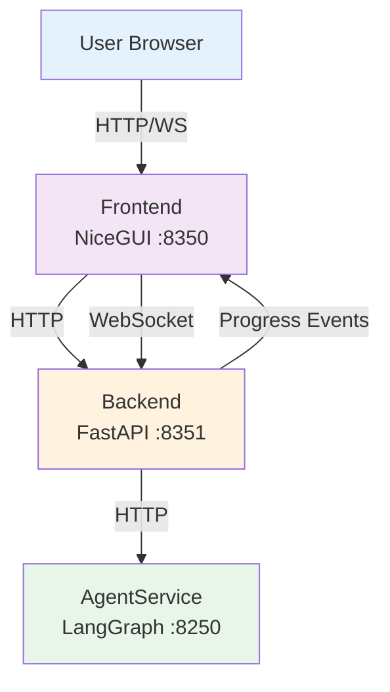
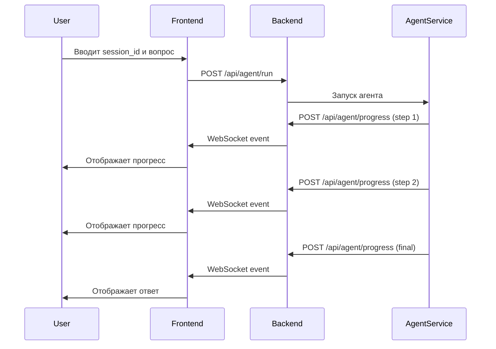

# Web UI Service - Документация

**Обновлено:** 2025-12-26  
**Статус:** Production Ready ✅

---

## 📋 Overview

Web UI Service — это модульная система для взаимодействия с LLM Agent через веб-интерфейс с real-time прогрессом.

### 🎯 Назначение
- Предоставить пользователю удобный интерфейс для работы с агентом
- Отображать прогресс выполнения в реальном времени
- Сохранять историю диалогов
- Поддерживать множество сессий одновременно

---

## 🏗️ Architecture

### Высокоуровневая схема



---

## 📦 Components

### 1. Backend (FastAPI)

**Расположение:** `backend/`  
**Порт:** 8351  
**Назначение:** API Gateway + WebSocket Hub

**Ключевые возможности:**
- REST API для взаимодействия с AgentService
- WebSocket сервер для real-time событий
- CORS middleware
- Rate limiting
- Structured logging
- Health checks
- Graceful shutdown

**Связи:**
- ← Frontend (HTTP + WebSocket)
- → AgentService (HTTP)

**Документация:** [backend/README.md](../backend/README.md)

---

### 2. Frontend (NiceGUI)

**Расположение:** `frontend/`  
**Порт:** 8350  
**Назначение:** User Interface

**Ключевые возможности:**
- Session management
- WebSocket subscription
- Progress rendering
- History recovery
- MathJax support
- Responsive UI

**Связи:**
- → Backend (HTTP + WebSocket)
- ← User (Browser)

**Документация:** [frontend/README.md](../frontend/README.md)

---

## 🔗 Data Flow

### Sequence Diagram



---

## 🔒 Security

### Authentication
- **WebSocket:** Токен в URL (`?token=...`)
- **API:** Rate limiting (5 req/min для run, 10/min для других)

### Protection
- **CORS:** Только разрешенные origins
- **Rate Limiting:** Защита от спама
- **Input Validation:** Pydantic модели

### Secrets
- `WS_TOKEN` — токен для WebSocket
- Хранить в `.env` (никогда в коде!)

---

## 🚀 Deployment

### Development

```bash
cd web_ui_service
docker-compose -f docker-compose-dev.yml up --build
```

**Сервисы:**
- `web_ui_backend:8351` — FastAPI
- `web_ui_frontend:8350` — NiceGUI

### Production

```bash
export WS_TOKEN=your_secure_token
docker-compose -f docker-compose-prod.yml up -d
```

**Особенности:**
- Health checks
- Restart policies
- Separate networks
- No volume mounts

---

## 📊 Monitoring

### Health Endpoints

**Backend:**
```bash
curl http://localhost:8351/health
```

### Logs

Structured JSON logs с информацией о:
- Подключениях WebSocket
- Запросах к API
- Ошибках
- Сессиях

---

## 🔧 Configuration

### Environment Variables

**Backend (.env):**
```bash
BACKEND_PORT=8351
AGENT_SERVICE_URL=http://agent_dev:8250
WS_TOKEN=dev_token_123
LOG_LEVEL=INFO
ALLOWED_ORIGINS=http://localhost:8350,http://web_ui_frontend:8350
```

**Frontend (.env):**
```bash
FRONTEND_PORT=8350
BACKEND_URL=http://web_ui_backend:8351
WS_TOKEN=dev_token_123
LOG_LEVEL=INFO
```

---

## 🎯 Usage Workflow

### 1. Start Services
```bash
docker-compose -f docker-compose-dev.yml up
```

### 2. Open Browser
```
http://localhost:8350
```

### 3. Configure Session
- Enter `session_id` (e.g., `my_session`)
- Click "Установить" → загрузит историю
- Click "Подключиться" → WebSocket connection

### 4. Send Message
- Type question
- Click "Отправить"
- Watch progress events in real-time

### 5. View Results
- Final answer appears as Agent message
- All events logged in UI
- History saved for next load

---

## 📈 Scaling

### Horizontal Scaling

**Backend:**
- Можно запускать несколько инстансов
- За LB (Nginx/HAProxy)
- WebSocket sticky sessions

**Frontend:**
- Stateless
- Можно масштабировать сколько угодно
- Подходит для CDN

---

## 📚 Additional Documentation

- **[Backend Details](../backend/README.md)** — API, endpoints, security
- **[Frontend Details](../frontend/README.md)** — UI, components, usage
- **[Production Plan](../plan/production_ready.md)** — Detailed implementation plan
- **[Architecture](../plan/new_arhitecture.md)** — Technical architecture

---

## 🎉 Summary

**Web UI Service — это production-ready система с:**

✅ Модульной архитектурой  
✅ Безопасностью (CORS, rate limiting, auth)  
✅ Надежностью (health checks, graceful shutdown)  
✅ Масштабируемостью (отдельные сервисы)  
✅ Мониторингом (structured logs)  
✅ Документацией (все уровни)  

**Готово к использованию в production!** 🚀