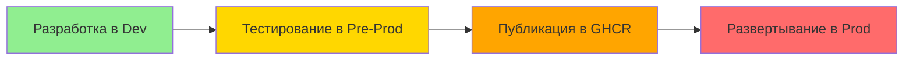

# 🐳 Docker Deployment Guide

Это руководство описывает систему Docker-развертывания для Web UI Service с разделением на frontend и backend, development, pre-production и production окружениями.

## 📁 File Structure

```
web_ui_service/
├── frontend/
│   ├── Dockerfile-dev             # Dev frontend (сборка React внутри контейнера)
│   ├── Dockerfile-prod            # Prod frontend (готовый образ)
│   ├── react/                     # Исходники React
│   │   ├── package.json
│   │   ├── nginx.conf
│   │   └── src/
│   └── nginx-prod.conf            # Prod nginx config
├── backend/
│   ├── Dockerfile-dev             # Dev backend (volume монтирование)
│   ├── Dockerfile-prod            # Prod backend (включает код)
│   ├── app.py                     # FastAPI приложение
│   └── app_settings-dev.json      # Dev config
├── docker-compose-dev.yml         # Dev окружение (порт 8350/8351)
├── docker-compose-preprod.yml     # Pre-prod окружение (порт 8350/8351)
├── docker-compose-prod.yml        # Prod окружение (порт 8150/8151)
├── app_settings-prod.json         # Prod config
└── docs/
    └── docker_deployment.md       # Эта документация
```

## 🎨 Version Indicator

UI отображает индикатор версии:
- **Dev версия**: Красный баннер "⚠️ Это dev версия" вверху
- **Pre-prod версия**: Желтый баннер "⚠️ Это pre-production версия"
- **Prod версия**: Без индикатора

Это помогает визуально различать окружения при одновременном запуске.

---

## 🔄 Workflow: Development → Pre-Production → Production

### Полный цикл разработки и релиза:



### 1. Development Phase
**Цель**: Быстрая разработка с hot reload
```bash
cd web_ui_service
docker compose -f docker-compose-dev.yml up --build
```
- Порты: 8350 (frontend), 8351 (backend), 8250 (agent)
- Код монтируется через volume
- Frontend собирается автоматически

### 2. Pre-Production Phase
**Цель**: Тестирование prod-сборки перед релизом
```bash
# Собираем prod-образы
cd web_ui_service/frontend
docker build -f Dockerfile-prod -t web_ui_frontend:preprod .
cd ../backend
docker build -f Dockerfile-prod -t web_ui_backend:preprod .

# Запускаем pre-prod
cd ..
docker compose -f docker-compose-preprod.yml up
```
- Порты: 8350 (frontend), 8351 (backend), 8250 (agent)
- Использует те же порты, что и dev
- Код внутри образов (как в prod)
- Изолированная сеть `web_ui_network_preprod`

### 3. Production Phase
**Цель**: Production для пользователей
```bash
# Публикация в GHCR
docker tag web_ui_frontend:preprod ghcr.io/lifelong-learning-assisttant/web_ui_frontend:v002
docker push ghcr.io/lifelong-learning-assisttant/web_ui_frontend:v002

# Запуск prod
cd web_ui_service
docker compose -f docker-compose-prod.yml up
```
- Порты: 8150 (frontend), 8151 (backend), 8270 (agent)
- Образы из GHCR
- Стабильная работа для пользователей

---

## 🔹 Development Mode

### Назначение
- Быстрая разработка с горячей перезагрузкой backend
- Автоматическая сборка React frontend
- Изменения кода отражаются мгновенно
- Используется для отладки и тестирования новых фич

### Архитектура Dev Mode

```
┌─────────────────────────────────────────┐
│  Frontend (React)                       │
│  Порт: 8350                             │
│  nginx + собранный React                │
│  (Dockerfile-dev собирает React)        │
└─────────────────┬───────────────────────┘
                  │
                  │ API requests
                  ↓
┌─────────────────────────────────────────┐
│  Backend (FastAPI)                      │
│  Порт: 8351                             │
│  Volume монтирование кода               │
│  Hot reload поддержка                   │
└─────────────────────────────────────────┘
                  │
                  │ Agent requests
                  ↓
┌─────────────────────────────────────────┐
│  Agent Service                          │
│  Порт: 8250                             │
└─────────────────────────────────────────┘
```

### Использование

**1. Запуск всех сервисов:**
```bash
cd web_ui_service
docker compose -f docker-compose-dev.yml up --build
```

**2. Проверка работы:**
```bash
curl http://localhost:8350
curl http://localhost:8351/health
```

**3. Остановка:**
```bash
docker compose -f docker-compose-dev.yml down
```

---

## 🟡 Pre-Production Mode (NEW!)

### Назначение
- **Тестирование prod-сборки** перед релизом
- Проверка что prod-образы работают корректно
- Тестирование без влияния на пользователей
- Отладка production-конфигурации

### Ключевые особенности

| Аспект | Pre-Prod | Dev | Prod |
|--------|----------|-----|------|
| **Порты** | 8350/8351/8250 | 8350/8351/8250 | 8150/8151/8270 |
| **Код** | Внутри образа | Volume | Внутри образа |
| **Сборка** | Prod Dockerfile | Dev Dockerfile | Prod Dockerfile |
| **Образы** | Локальные preprod | Локальные dev | GHCR |
| **Сеть** | web_ui_network_preprod | web_ui_network_dev | web_ui_network_prod |
| **Цель** | Тестирование prod | Разработка | Пользователи |

### Почему pre-prod важен?

1. **Безопасность**: Можно тестировать prod-сборку не затрагивая пользователей
2. **Изоляция**: Отдельная сеть, не конфликтует с dev и prod
3. **Скорость**: Не нужно публиковать в GHCR для тестирования
4. **Удобство**: Использует те же порты, что и dev (удобно для тестов)

### Архитектура Pre-Prod Mode

```
┌─────────────────────────────────────────┐
│  Frontend (React)                       │
│  Порт: 8350                             │
│  nginx + React из локального образа     │
│  web_ui_frontend:preprod                │
└─────────────────┬───────────────────────┘
                  │
                  │ API requests
                  ↓
┌─────────────────────────────────────────┐
│  Backend (FastAPI)                      │
│  Порт: 8351                             │
│  Код внутри образа                      │
│  web_ui_backend:preprod                 │
└─────────────────────────────────────────┘
                  │
                  │ Agent requests
                  ↓
┌─────────────────────────────────────────┐
│  Agent Service                          │
│  Порт: 8250                             │
│  agent_service:preprod                  │
└─────────────────────────────────────────┘
```

### Использование

**1. Сборка pre-prod образов:**
```bash
# Frontend
cd web_ui_service/frontend
docker build -f Dockerfile-prod -t web_ui_frontend:preprod .

# Backend
cd ../backend
docker build -f Dockerfile-prod -t web_ui_backend:preprod .

# Agent
cd ../../agent_service
docker build -f Dockerfile-prod -t agent_service:preprod .
```

**2. Запуск pre-prod:**
```bash
# Web UI Service
cd web_ui_service
docker compose -f docker-compose-preprod.yml up

# Agent Service (в другом терминале)
cd ../agent_service
docker compose -f docker-compose-preprod.yml up
```

**3. Проверка работы:**
```bash
# Все на тех же портах, что и dev!
curl http://localhost:8350
curl http://localhost:8351/health
curl http://localhost:8250/health
```

**4. Остановка:**
```bash
docker compose -f docker-compose-preprod.yml down
```

### Когда использовать pre-prod?

✅ **Используйте pre-prod когда:**
- Закончили разработку фичи в dev
- Хотите проверить prod-сборку
- Нужно протестировать перед релизом
- Хотите убедиться что все работает как в prod

❌ **Не используйте pre-prod когда:**
- Нужно быстро менять код (hot reload)
- Только начинаете разработку
- Нужны dev-инструменты (debug, logs)

---

## 🔸 Production Mode

### Назначение
- Стабильная версия для пользователей
- Использует предсобранные Docker-образы из GHCR
- Подходит для CI/CD и production-окружений

### Архитектура Prod Mode

```
┌─────────────────────────────────────────┐
│  Frontend (React)                       │
│  Порт: 8150                             │
│  nginx + React из GHCR                  │
│  ghcr.io/.../web_ui_frontend:v001       │
└─────────────────┬───────────────────────┘
                  │
                  │ API requests
                  ↓
┌─────────────────────────────────────────┐
│  Backend (FastAPI)                      │
│  Порт: 8151                             │
│  Код внутри образа из GHCR              │
│  ghcr.io/.../web_ui_backend:v001        │
└─────────────────────────────────────────┘
                  │
                  │ Agent requests
                  ↓
┌─────────────────────────────────────────┐
│  Agent Service                          │
│  Порт: 8270                             │
│  ghcr.io/.../agent_service:v001         │
└─────────────────────────────────────────┘
```

### Использование

**1. Запуск из GHCR:**
```bash
cd web_ui_service
docker compose -f docker-compose-prod.yml up
```

**2. Проверка работы:**
```bash
curl http://localhost:8150
curl http://localhost:8151/health
```

**3. Остановка:**
```bash
docker compose -f docker-compose-prod.yml down
```

---

## 📦 GitHub Container Registry

### Публикация образов

```bash
# Логин в GHCR
docker login ghcr.io/lifelong-learning-assisttant

# Frontend
cd web_ui_service/frontend
docker build -f Dockerfile-prod -t ghcr.io/lifelong-learning-assisttant/web_ui_frontend:v001 .
docker push ghcr.io/lifelong-learning-assisttant/web_ui_frontend:v001

# Backend
cd ../backend
docker build -f Dockerfile-prod -t ghcr.io/lifelong-learning-assisttant/web_ui_backend:v001 .
docker push ghcr.io/lifelong-learning-assisttant/web_ui_backend:v001

# Agent
cd ../../agent_service
docker build -f Dockerfile-prod -t ghcr.io/lifelong-learning-assisttant/agent_service:v001 .
docker push ghcr.io/lifelong-learning-assisttant/agent_service:v001
```

### Доступные образы

- `ghcr.io/lifelong-learning-assisttant/web_ui_frontend:v001` - React frontend
- `ghcr.io/lifelong-learning-assisttant/web_ui_backend:v001` - FastAPI backend
- `ghcr.io/lifelong-learning-assisttant/agent_service:v001` - Agent service

---

## 📊 Полное сравнение сред

| Аспект | Development | Pre-Production | Production |
|--------|-------------|----------------|------------|
| **Назначение** | Разработка | Тестирование prod | Пользователи |
| **Frontend порт** | 8350:80 | 8350:80 | 8150:80 |
| **Backend порт** | 8351:8351 | 8351:8351 | 8151:8151 |
| **Agent порт** | 8250:8250 | 8250:8250 | 8270:8270 |
| **Сеть** | web_ui_network_dev | web_ui_network_preprod | web_ui_network_prod |
| **Frontend код** | Сборка в контейнере | Prod-образ (локальный) | Prod-образ из GHCR |
| **Backend код** | Volume (hot reload) | Prod-образ (локальный) | Prod-образ из GHCR |
| **Agent код** | Volume (hot reload) | Prod-образ (локальный) | Prod-образ из GHCR |
| **Образы** | Локальные dev | Локальные preprod | GHCR |
| **Публикация** | Нет | Нет | Да (GHCR) |
| **Скорость** | ⚡⚡⚡ Очень быстро | ⚡ Быстро | 🐌 Зависит от сети |
| **Риск** | Низкий (только dev) | Средний (тестирование) | Высокий (пользователи) |

---

## 🔧 Переменные окружения

### Backend
- `BACKEND_PORT` - порт FastAPI (8351 dev/preprod / 8151 prod)
- `AGENT_SERVICE_URL` - URL агент сервиса
- `ALLOWED_ORIGINS` - CORS origins
- `ENVIRONMENT` - development/preproduction/production
- `WS_TOKEN` - токен WebSocket
- `SETTINGS_FILE` - файл конфигурации

### Frontend
- Переменные окружения не требуются (nginx конфиг фиксированный)

---

## ✅ Verification

### Development
```bash
cd web_ui_service
docker compose -f docker-compose-dev.yml up --build
curl http://localhost:8350
curl http://localhost:8351/health
docker compose -f docker-compose-dev.yml down
```

### Pre-Production
```bash
# Сборка
cd web_ui_service/frontend
docker build -f Dockerfile-prod -t web_ui_frontend:preprod .
cd ../backend
docker build -f Dockerfile-prod -t web_ui_backend:preprod .

# Запуск
cd ..
docker compose -f docker-compose-preprod.yml up
curl http://localhost:8350
curl http://localhost:8351/health
docker compose -f docker-compose-preprod.yml down
```

### Production
```bash
cd web_ui_service
docker compose -f docker-compose-prod.yml up
curl http://localhost:8150
curl http://localhost:8151/health
docker compose -f docker-compose-prod.yml down
```

### Одновременный запуск всех сред
```bash
# Terminal 1 - Development
cd web_ui_service
docker compose -f docker-compose-dev.yml up --build

# Terminal 2 - Pre-Production
cd web_ui_service
docker compose -f docker-compose-preprod.yml up

# Terminal 3 - Production
cd web_ui_service
docker compose -f docker-compose-prod.yml up
```

Имена контейнеров:
- `web_ui_service-frontend-dev` (dev, порт 8350)
- `web_ui_service-backend-dev` (dev, порт 8351)
- `web_ui_service-frontend-preprod` (preprod, порт 8350)
- `web_ui_service-backend-preprod` (preprod, порт 8351)
- `web_ui_service-web_ui_frontend-1` (prod, порт 8150)
- `web_ui_service-web_ui_backend-1` (prod, порт 8151)

---

## ⚠️ Troubleshooting

### Development
**Frontend возвращает 403/500:**
- Проверьте что React собрался: `docker logs web_ui_service-frontend-dev`

**Backend не видит изменения:**
- Проверьте volume: `docker inspect web_ui_service-backend-dev | grep Mounts`

### Pre-Production
**Образы не найдены:**
- Убедитесь что preprod-образы собраны: `docker images | grep preprod`

**Порт занят:**
- Остановите dev-контейнеры: `docker compose -f docker-compose-dev.yml down`

### Production
**Образы не найдены:**
- `docker compose -f docker-compose-prod.yml pull`

**CORS ошибки:**
- Проверьте ALLOWED_ORIGINS в backend

---

## 📚 Related Documents

- [Web UI Documentation](web-ui.md)
- [API Documentation](api_documentation.md)
- [Network Interaction](network_interaction.md)
- [Agent Service Deployment](../../agent_service/docs/docker_deployment.md)

---

## 🎯 Quick Reference

| Команда | Dev | Pre-Prod | Prod |
|---------|-----|----------|------|
| **Запуск** | `up --build` | `up` (после сборки) | `up` |
| **Сборка** | Авто | Вручную | Вручную (GHCR) |
| **Порты** | 8350/8351/8250 | 8350/8351/8250 | 8150/8151/8270 |
| **Hot reload** | ✅ Да | ❌ Нет | ❌ Нет |
| **Использование** | Разработка | Тестирование prod | Пользователи |