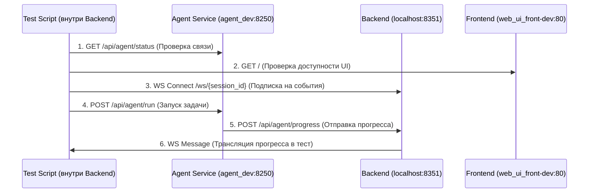

# Интеграционное тестирование Web UI

Этот документ описывает сетевую структуру и процесс интеграционного тестирования компонентов Web UI.

## Сетевая структура (DEV)

Все сервисы работают в Docker-сети `web_ui_network_dev`.

| Сервис | Сетевой алиас | Контейнер | Внутренний порт | Внешний порт |
| :--- | :--- | :--- | :--- | :--- |
| **Agent Service** | `agent_dev` | `agent_service-agent_dev-1` | `8250` | `8250` |
| **Web UI Backend** | `web_ui_back-dev` | `web_ui_service-backend-dev` | `8351` | `8351` |
| **Web UI Frontend** | `web_ui_front-dev` | `web_ui_service-frontend-dev` | `80` | `8350` |

## Схема взаимодействия в тесте `test_full_flow.py`

Тест запускается внутри контейнера бэкенда и проверяет полную цепочку прохождения сообщений и событий.



## Запуск теста

Для запуска теста необходимо выполнить команду:

```bash
docker exec web_ui_service-backend-dev uv run python /app/tests_integration/test_full_flow.py
```

## Особенности реализации

1.  **WebSocket Hub**: Бэкенд выступает в роли хаба, принимая события прогресса от `AgentService` по HTTP POST и транслируя их подключенным клиентам (фронтенду или тесту) через WebSocket.
2.  **Аутентификация**: WebSocket соединение защищено токеном `WS_TOKEN` (в dev-режиме: `dev_token_123`).
3.  **Изоляция**: События фильтруются по `session_id`, гарантируя, что клиент получает сообщения только своей сессии.

## Лайфхак: Отладка через браузер

Вы можете наблюдать за выполнением интеграционного теста в реальном времени через Web UI:
1. Запустите тест в терминале.
2. Скопируйте `session_id` из лога теста (например, `netrunner_test_1768561085`).
3. Откройте Web UI в браузере и вставьте этот ID в URL: `http://localhost:8350/?session_id=YOUR_ID`.
4. Вы увидите всю переписку и системные события, которые генерирует тест.