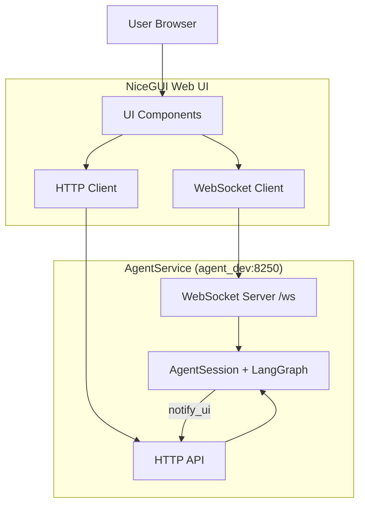

# Документация Web UI

## Обзор

Web UI предоставляет NiceGUI-интерфейс для взаимодействия с системой агентов ЛЛМ. Поддерживает реальное время через WebSocket, управление сессиями и визуализацию событий прогресса.

## Архитектура

### Компоненты



### Поток данных

1. **Сессия**: Пользователь вводит `session_id` → NiceGUI сохраняет
2. **Подключение**: "Подключиться" → WebSocket к `/ws`
3. **Сообщение**: Отправка → HTTP POST `/api/agent/run`
4. **Обработка**: AgentService → AgentSession → LangGraph flow
5. **Прогресс**: Каждый узел → `notify_ui()` → POST `/api/agent/progress`
6. **Отображение**: Web UI получает события → Показывает прогресс

## Конфигурация

### Файлы настроек

**Разработка** (`app_settings-dev.json`):
```json
{
  "web_ui_port": 8350,
  "agent_service_url": "http://agent_dev:8250",
  "is_dev_version": true
}
```

**Продакшен** (`app_settings-prod.json`):
```json
{
  "web_ui_port": 8150,
  "agent_service_url": "http://agent_service:8250",
  "is_dev_version": false
}
```

### Зависимости

См. [`pyproject.toml`](../pyproject.toml):
- nicegui>=1.0.0
- httpx>=0.28.1
- websockets>=15.0.1
- pytest>=7.0.0
- pytest-asyncio>=0.21.0

## Запуск

### Docker Compose (Разработка)

```bash
docker-compose -f web_ui_service/docker-compose-dev.yml up -d
docker logs -f web_ui_service-web_ui_dev-1
```

### Вручную

```bash
cd web_ui_service
uv run python web_ui.py --settings app_settings-dev.json
```

### Доступ

Откройте: `http://localhost:8350`

## Использование

### Базовый workflow

1. **Введите session_id**: Любое имя (например, `demo_quiz_1`)
2. **Загрузите историю**: "Загрузить" → показать сообщения
3. **Подключитесь**: "Подключиться" → WebSocket активен
4. **Отправьте сообщение**: Введите вопрос
5. **Следите за прогрессом**: Реальное время

### Примеры session_id

- `test_quiz_1` — Тестовый квиз
- `dl_formulas_1` — Формулы DL
- `rag_demo_1` — RAG демо
- `user_123` — Персональная сессия

### События прогресса

UI показывает шаги:
- `intent_determined` — Определен намерение
- `start_retrieval` — Начало поиска RAG
- `retrieval_done` — RAG завершен
- `start_generate_exam` — Генерация квиза
- `generate_done` — Генерация завершена
- `final_answer` — Финальный ответ

## API Endpoints

### Web UI → AgentService

**POST /api/agent/run**
```http
POST http://localhost:8250/api/agent/run
Content-Type: application/json

{"question": "...", "session_id": "demo_quiz_1"}
```

**GET /api/messages**
```http
GET http://localhost:8250/api/messages?session_id=demo_quiz_1
```

### AgentService → Web UI (WebSocket)

**WebSocket:** `ws://localhost:8250/ws`

**Подписка:**
```json
{"cmd": "subscribe", "session_id": "demo_quiz_1"}
```

**События:**
```json
{"type": "progress", "step": "intent_determined", "details": "...", "session_id": "..."}
{"type": "error", "message": "...", "session_id": "..."}
{"type": "final", "answer": "...", "session_id": "..."}
```

## Тестирование

### Unit Test: Симуляция Web UI (2.1)

**Цель**: Детерминированная симуляция без реального агента.

**Запуск:**
```bash
docker exec web_ui_service-web_ui_dev-1 uv run pytest tests/test_web_ui_simulation.py -v
```

**Результат**: 7/7 тестов проходят

**Что проверяется**:
- Форматирование сообщений (User, Agent, Progress)
- Рендеринг формул MathJax
- Стили сообщений
- Изоляция сессий
- Последовательность событий прогресса
- WebSocket и HTTP mocks

**Формулы в тесте**:
- MSE: $$MSE = \frac{1}{n}\sum(y_i - \hat{y}_i)^2$$
- Линейная регрессия: $y = wx + b$
- Градиент: $\nabla L = \frac{2}{n}X^T(Xw - y)$

### Демо скрипт

**Файл**: [`test_task_g_demo.py`](../test_task_g_demo.py)

```python
import asyncio
import httpx

async def test_full_flow():
    async with httpx.AsyncClient() as client:
        # Отправка запроса
        await client.post(
            "http://localhost:8250/api/agent/run",
            json={"question": "Сгенерируй квиз", "session_id": "demo_quiz_1"}
        )
        
        # Проверка истории
        history = await client.get(
            "http://localhost:8250/api/messages",
            params={"session_id": "demo_quiz_1"}
        )
        print(f"История: {len(history.json()['messages'])} сообщений")

asyncio.run(test_full_flow())
```

## Механизмы

### 1. Управление сессиями

**Изоляция**: Каждый `session_id` = отдельная комната WebSocket
- `connections_by_session = {"quiz_1": {ws1, ws2}, "quiz_2": {ws3}}`
- `notify_ui()` отправляет только в нужную комнату

### 2. Fire-and-Forget

```python
async def notify_ui(self, step: str, details: str = ""):
    # Не блокирует основной поток
    try:
        async with httpx.AsyncClient() as client:
            await client.post(url, json=event, timeout=0.1)
    except:
        pass  # Тихий отказ
```

### 3. Восстановление истории

```python
# При обновлении страницы
GET /api/messages?session_id=...
→ Отображает историю
```

### 4. Последовательность прогресса

```
intent_determined → start_retrieval → retrieval_done
→ start_generate_exam → generate_done → final_answer
```

## Примеры

### Пример 1: Формулы DL

**User**: "Объясни формулу MSE с примерами"

**Прогресс**:
```
intent_determined: MSE formula explanation
retrieval_done: Found 3 examples
generate_done: Response ready
```

**Agent**:
```
Mean Squared Error (MSE).

Формула:
$$MSE = \frac{1}{n}\sum_{i=1}^{n}(y_i - \hat{y}_i)^2$$

Пример:
- $y = [2, 4, 6]$
- $\hat{y} = [1.5, 4.2, 5.8]$
- MSE = 0.113
```

### Пример 2: RAG + Квиз

**User**: "Сгенерируй квиз по линейной регрессии"

**Прогресс**:
```
intent_determined: Quiz generation
start_retrieval: Searching RAG
retrieval_done: Found 5 chapters
start_generate_exam: Creating questions
generate_done: 3 questions ready
```

**Agent**:
```
Квиз по линейной регрессии:

1. Что такое MSE?
   a) Mean Squared Error
   b) Maximum Squared Error

2. Формула линейной регрессии?
   a) $y = wx + b$
   b) $y = w^2x$
```

## Best Practices

### Для разработчиков

1. Всегда используйте `session_id` для изоляции
2. Обрабатывайте ошибки без блокировки UI
3. Fire-and-forget для `notify_ui`
4. Тестируйте через API
5. Проверяйте логи

### Для тестирования

1. **Unit tests** — детерминированные, без зависимостей
2. **Integration tests** — с реальными сервисами
3. **E2E tests** — полный flow

## Отладка

### WebSocket не подключается

**Проверьте**:
```bash
# AgentService запущен?
docker ps | grep agent

# WebSocket endpoint
curl http://localhost:8250/ws
```

### Прогресс не показывается

**Проверьте**:
1. WebSocket подключен (зеленый индикатор)
2. Правильный `session_id`
3. Логи AgentService на ошибки

### Формулы не рендерятся

**Проверьте**:
- `$...$` для inline
- `$$...$$` для блока
- Без пробелов: `$ x^2 $` ❌, `$x^2$` ✅

## Файлы

- **Основной**: [`web_ui.py`](../web_ui.py)
- **Тесты**: [`tests/test_web_ui_simulation.py`](../tests/test_web_ui_simulation.py)
- **Демо**: [`test_task_g_demo.py`](../test_task_g_demo.py)
- **Docker**: [`docker-compose-dev.yml`](../docker-compose-dev.yml)
- **Настройки**: [`app_settings-dev.json`](../app_settings-dev.json)

## Статус

**Task G завершен**:
- ✅ NiceGUI Web UI с WebSocket
- ✅ Управление сессиями
- ✅ События прогресса
- ✅ Восстановление истории
- ✅ Unit tests (7/7)
- ✅ Документация

**Следующие шаги**:
- Task H1: Unit tests
- Task H2: Integration tests
- Task H3: E2E tests